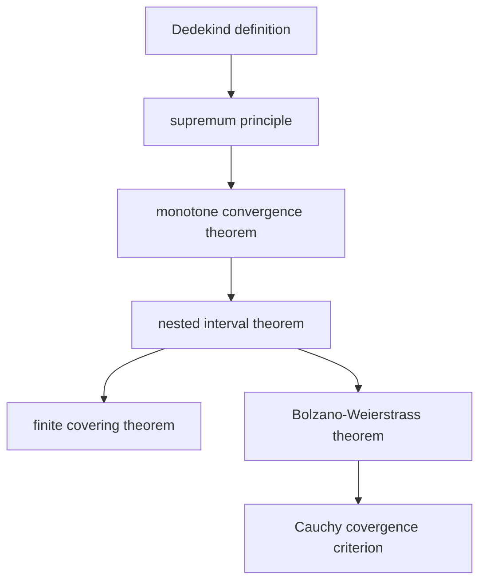

# Real Number 实数

- Integer 整数
- Rational Number 商数（有理数）：两个整数的商，分母非零
- Real Number 实数：有理数的缝隙，使用Dedekind Cut，能在有理数的缝隙上定义出唯一的实数（Dedekind Completeness Theorem）。

实数完备的意义：实数集没有缝隙

实数完备性的六大等价定理

1. 确界原理（supremum principle）：实数集的任意非空有上界的子集必有上确界（最小上界）
2. 单调有界定理：单调有界数列必收敛
3. 区间套定理：闭区间套必收敛到唯一实数
4. 有限覆盖定理：闭区间的开覆盖必有有限子覆盖
5. 聚点定理（Bolzano-Weierstrass Theorem）
6. 柯西收敛准则：数列收敛的充要条件是柯西列
	- Cauchy Sequence: $\forall \epsilon > 0, \exists N,  |x_m - x_n| < \epsilon$

## Dedekind Definition

实数的戴德金定义

Dedekind Cut 定义的实数集: 实数集被定义为所有$\mathbb{Q}$的戴德金分割：

partition of $\mathbb{Q}$ into two sets $A$ and $B$ such that:
1. Each element of A is less than B
2. A contains no largest element

Another Interpretation of this definition is: every real number is defined as a subset of rational number set $\mathbb{Q}$.
### Dedekind Completeness Theorem

Proposition：**实数**集$\mathbb{R}$的有序分划（$A\cap B = \emptyset$、$\forall a \in A, b \in B, a < b$）确定一个唯一的实数

在实数集$\mathbb{R}$中，非空有上界的集合，必定存在一最小上界（Supremum）

集合$S$中所有实数对应的戴德金分割左集的并集：
$$
\gamma = \bigcup_{\alpha \in S} \alpha
$$
$\gamma$ 是一个戴德金分划（是一个实数）
- $\gamma$是一个有理数集：$\alpha$都是有理数集
- $\gamma$非空非$\mathbb{Q}$：$S$ 有上界$\beta$，因此$\alpha \subseteq \beta$，因此$\gamma \subseteq \beta \subsetneq Q$，
- 向下封闭性/有序性：任意$p,q \in \gamma$，如果$q \lt p$，那么$\exists \alpha, p \in \alpha$，又$q \le p$，$q \in \alpha \rightarrow q \in \gamma$，所以$q \leq p \rightarrow q \in \gamma$，或$q \in Q \backslash P \rightarrow q \gt q$
- 无最大元：$\forall p \in \gamma, \exists \alpha, p \in \alpha \rightarrow \exists p' \in \alpha s.t. p'>p$

$\gamma$是$S$的一个上界：
- $\forall \alpha \in S, \alpha \subseteq \gamma \rightarrow \alpha < \gamma$

$\gamma$是$S$的最小上界：
- 对于$S$的任意上界$\delta$，$\forall \alpha \in S, \alpha \subseteq \delta \rightarrow \gamma \subseteq \delta \rightarrow \gamma < \delta$

> [!note] 实数即集合
> 在Dedekind Cut的定义里，实数是由分割定义的，因此这个分割的左集——比它小的有理数集合就定义了一个实数。

>[!note] 实数次序的定义
>$\gamma < \delta \Leftrightarrow \gamma \subseteq \delta$

>[!note] 上确界原理 证明思路
>Dedekind Cut定义的实数是有理数集的有序分割左集，任意有上界的实数集都能转换为对应有理数分割左集的并集。实数集等价的有理数分割左集并集也是几个有理数集，也对应一个实数，而其为实数集的最小超集，因此当有上界的时候，上确界存在且总是等于实数集等价的有理数分割左集并集。

>[!note] Dedekind Completeness Theorem 证明思路
>证明上确界原理：所有有上界实数集都有上确界，从而所有实数集分划左集都有上确界，从而有序分划能唯一确定一实数。
> [!note] 为什么确界原理就是实数完备性
> 确界原理说任意有界实数集合都有上确界，就是说实数的任意分划能靠左集的有界性能确定唯一的一个实数。这样实数就不会像有理数一样，分划不能用来确定唯一的有理数，即“有洞”了。

> [!note] 有理数的稠密性：在任意两个实数之间，能找到有理数。
> 
> 对于$a,b\in \mathbb{R}$，$\exists N \in \mathbb{Z}, 1/N < b - a, \exists k\in \mathbb{Z} k < na < k+1$，所以总有$nb > na + 1 > k+1, na <k+1 \rightarrow a < \frac{k+1}{n} < b$

## Monotone Convergence Theorem

单调有界的数列收敛 $\exists M, a_n < M$，$\lim a_n$ 存在。

根据上确界原理，设$\{x_n\}$ 的上确界为$\gamma$

$$
\forall \epsilon >0, \exists N > 0, \gamma - \epsilon < a_N < a_n <\gamma + \epsilon
$$
因此单调有界的数列必收敛，且收敛于上确界

## Nested Interval Theorem

闭区间Compactness

有且仅有唯一的点，属于所有区间

闭区间列$\{I_n\}$，$I_n = [a_n, b_n]$，
1. $I_{n+1} \subseteq I_n$
2. $\lim_{\infty} (b_n - a_n) = 0$

左端点序列$\{a_n\}$单调递增且有界，因此极限$\alpha = \lim_{n\to \infty} a_n$存在且$a_n \le \alpha$
右端点序列同理，$\beta = \lim_{n\to\infty}b_n$存在，且$b_n \ge \beta$，由极限运算法则和区间长度趋向零得：
$$
\lim_{n \to \infty} (b_n - a_n) = \lim_{n\to\infty}b_n - \lim_{n\to\infty}a_n = \alpha - \beta = 0 \Longrightarrow \alpha = \beta
$$
$\xi=\alpha=\beta$ 同时小于等于所有$b_n$，同时大于等于所有$a_n$，因此$\forall n, \xi \in I_n$
唯一性：如果有两个$\xi_1 < \xi_2$都在$I_n$内，那么左右端点序列就有不同的极限，与区间长度趋向零矛盾。因此$\xi$唯一。

开区间套不能确定唯一的点：$(0, 1/n)$内的任意$\xi$总存在足够大的$N$使得$\xi > 1/N$ 从而$\xi \notin I_N$

## Finite Covering Theorem (Heine-Borel Theorem)

闭区间 Compactness

1. Open Cover：集合$K$的开覆盖$\{U_\alpha\}$，$\forall k \in K, \exists \alpha, k \in U_\alpha$，$U_\alpha$是开区间
2. Finite Subcover

闭区间$K$存在开覆盖，则有有限覆盖：
假设$K$不能被有限覆盖，二分$K$，选择一不能被有限覆盖的区间作为$I_0$，继续此操作构建闭区间套$\{I_n\}$，从而由闭区间套定理，确定唯一的实数$\xi$，而由于$\{U_\alpha\}$覆盖$K$，$\exists U_0, \xi \in U_0$，由于开覆盖，$\exists \delta, I_n \subset (\xi - \delta, \xi+\delta) \subset U_0$，从而被定义成不能被有限覆盖的区间被有限覆盖了，矛盾。

## Bolzano-Weierstrass Theorem

聚点定理 

有界数列必有收敛子列

有界无穷数列必有聚点（收敛子列）
$$|x_n| < M \Longrightarrow \exists \{x_{n_k}\} \subset \{x_n\}, \exists\lim_{n\to\infty}x_n
$$
证明
令$I_1 = [-M, M]$，$I_2$为二分的$I_1$中包含无穷项的一半，以此构造闭区间套$\{I_n\}$，从而能确定唯一的点$\forall n, \xi \in I_n$。从每个$I_k$中选择$x_{n_k}$，则由夹逼定理：$\lim_{k\to\infty} x_{n_k} = \xi$

## Cauchy Convergence Criterion

柯西收敛准则

实数数列$\{a_n\}$收敛的充要条件是该数列为柯西数列(Cauchy Sequence): 

$$
\forall \epsilon > 0, \exists N > 0, \forall m,n>N, |x_m-x_n| < \epsilon
$$

proof:

必要性
$$
|x_m - x_n | = |x_m - a + a - x_n| \le |x_m - a | + |x_n -a|
$$
显然，数列若收敛，必为柯西列

充分性：

柯西列有界，因此存在收敛的子列收敛于$a$，选取子列时下标$n_k$随着$k$增大而增大且$n_k \ge k$

因此$|x_n -a| < |x_n -x_{n_k}| + |x_{n_k} - a|$

对于任意$\epsilon > 0$，找到使得柯西列差值与a距离、收敛子列与a距离都小于$\epsilon / 2$的$N_1, K$，选择$N=\max\{N_1, K\}$，则
$$n > N_1, n_k > n>N_1, n_k > K \Longrightarrow |x_n - a | < \epsilon$$
